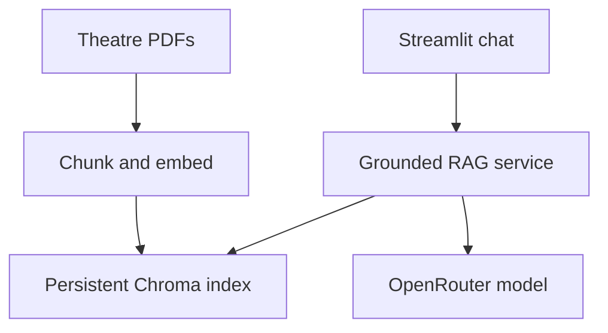

# Praxa Theater Assistant

Praxa is a production-oriented Streamlit RAG application that answers questions about Broadway and West End theatre using indexed PDF sources and page-level citations.

## Production capabilities

- Grounded answers with prompt-injection resistance and explicit abstention
- Deduplicated, page-level sources with expandable excerpts
- Lazy, cached RAG initialization and persistent Chroma storage
- Automatic first-run document ingestion
- Validated configuration and user input
- OpenRouter timeouts, retries, and optional fallback-model routing
- Per-session rate limiting, graceful errors, feedback, and chat export
- Non-root Docker runtime, health check, structured logs, CI, linting, and tests
- Railway config-as-code and volume-compatible storage paths

## Run locally

Requirements: Python 3.12 and an OpenRouter API key.

```bash
python -m venv .venv
source .venv/bin/activate
pip install -r requirements.txt
cp .env.example .env
streamlit run praxa_client.py
```

On Windows PowerShell, activate with `.venv\\Scripts\\Activate.ps1`. Set `OPENROUTER_API_KEY` in `.env`; never commit that file.

## Test and lint

```bash
pip install -r requirements-dev.txt
ruff check .
pytest --cov=. --cov-report=term-missing
```

## Deploy to Railway

1. Create a Railway project from `kadedipe/PraxaApp`.
2. Add `OPENROUTER_API_KEY` as a service variable.
3. Optionally set `OPENROUTER_MODEL` and `OPENROUTER_FALLBACK_MODEL`. Use funded, production-capable models rather than a rate-limited free endpoint.
4. Add a Railway volume mounted at `/app/data`. Praxa stores downloaded source PDFs and the Chroma index there.
5. Deploy. `railway.json` selects the Dockerfile and checks `/_stcore/health` before marking the release healthy.
6. Generate a public domain after the deployment is healthy.

The first start downloads the embedding model and source PDFs, then creates the index. Subsequent starts reuse the Railway volume.

## Environment variables

| Variable | Required | Default | Purpose |
|---|---:|---|---|
| `OPENROUTER_API_KEY` | Yes | — | OpenRouter credential |
| `OPENROUTER_MODEL` | No | `openai/gpt-4o-mini` | Primary chat model |
| `OPENROUTER_FALLBACK_MODEL` | No | empty | Fallback after primary failure |
| `VECTOR_STORE_PATH` | No | `/app/data/chromadb` | Persistent Chroma path |
| `CONTEXT_DATA_PATH` | No | `/app/data/context` | Persistent PDF path |
| `RETRIEVAL_K` | No | `5` | Retrieved chunks per request |
| `REQUEST_TIMEOUT_SECONDS` | No | `45` | Model request timeout |
| `MAX_QUESTION_CHARS` | No | `2000` | Input size limit |
| `REQUESTS_PER_MINUTE` | No | `12` | Per-session rate limit |

## Architecture



## Security note

The repository previously tracked `.env`. Removing it from the current tree does not erase it from Git history. Revoke and rotate that OpenRouter key before deploying, then consider a coordinated history rewrite if the repository must be made public.

## License

See [License.txt](License.txt).
