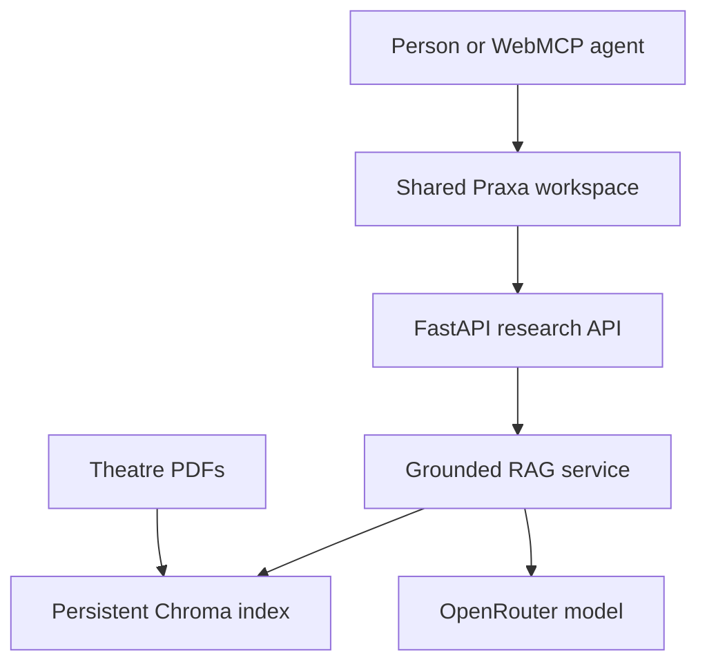

# Praxa — WebMCP Theatre Research

[](https://github.com/kadedipe/PraxaApp/actions/workflows/ci.yml)
[](https://praxa-web-production.up.railway.app/)
[](License.txt)

Praxa is a WebMCP-native theatre research assistant. It lets people and browser agents investigate Broadway and West End productions through grounded retrieval, page-level citations, and a shared visible workspace.

**Live app:** https://praxa-web-production.up.railway.app/

## Why WebMCP

A conventional chat widget traps useful actions inside its UI. Praxa progressively enhances the same human-facing website with typed browser tools, so an agent can research on a person's behalf without scraping the DOM or guessing how to click the interface. Every agent action also updates the visible result panel, keeping the person in the loop.

Praxa registers three tools with the imperative WebMCP API:

| Tool | Purpose |
|---|---|
| `ask_theatre` | Answer a grounded Broadway or West End question with page-level citations |
| `search_theatre_archive` | Semantically retrieve the strongest source passages without calling an LLM |
| `compare_productions` | Compare two productions on a user-selected focus using cited evidence |

The tool schemas constrain inputs, declare read-only and untrusted-content annotations, honor cancellation signals, and return structured JSON. The app remains fully usable in browsers without WebMCP.

## WebMCP Challenge work

Praxa existed as a Streamlit RAG prototype before the challenge. During the submission period it was meaningfully extended with:

- a same-origin WebMCP implementation using `document.modelContext.registerTool`;
- three task-specific tools backed by real retrieval and generation APIs;
- a new FastAPI service and accessible responsive workspace;
- visible human–agent handoff, semantic evidence search, and comparison workflows;
- origin isolation, a restrictive tools permissions policy, validation, health checks, and regression tests;
- Railway production deployment with a persistent Chroma index and CI-gated releases.

The timestamped Git history and WebMCP pull request document this work.

## Try the tools

Open the live app in ChatGPT's in-app browser, or Chrome 149+ with `chrome://flags/#enable-webmcp-testing` enabled. Ask the browser agent to:

- “Use Praxa to find Ryan Calais Cameron's most recent play and cite the page.”
- “Search Praxa's theatre archive for shows opening at the Apollo Theatre.”
- “Compare two productions in Praxa, focusing on venue and opening date.”

The status pill reports **3 WebMCP tools active** when registration succeeds.

## Architecture



## Run locally

Requirements: Python 3.12 and an OpenRouter API key.

```bash
python -m venv .venv
source .venv/bin/activate
pip install -r requirements.txt
export OPENROUTER_API_KEY="your-key"
uvicorn webapp:app --host 0.0.0.0 --port 8080
```

Then open http://localhost:8080.

## Test and lint

```bash
pip install -r requirements-dev.txt
ruff check .
pytest --cov=config --cov=praxa_rag --cov-report=term-missing --cov-fail-under=50
```

## Railway deployment

1. Connect Railway to this repository and wait for GitHub CI.
2. Set `OPENROUTER_API_KEY`.
3. Mount a persistent volume at `/app/data`.
4. Deploy from `main`. Railway builds the Dockerfile and checks `/healthz`.

The first start downloads the embedding model and source PDFs and creates the index. Later starts reuse `/app/data/chromadb`.

## Configuration

| Variable | Required | Default |
|---|---:|---|
| `OPENROUTER_API_KEY` | Yes | — |
| `OPENROUTER_MODEL` | No | `openai/gpt-4o-mini` |
| `OPENROUTER_FALLBACK_MODEL` | No | empty |
| `VECTOR_STORE_PATH` | No | `/app/data/chromadb` |
| `CONTEXT_DATA_PATH` | No | `/app/data/context` |
| `RETRIEVAL_K` | No | `5` |
| `REQUEST_TIMEOUT_SECONDS` | No | `45` |
| `MAX_QUESTION_CHARS` | No | `2000` |

## License

MIT — see [License.txt](License.txt).
